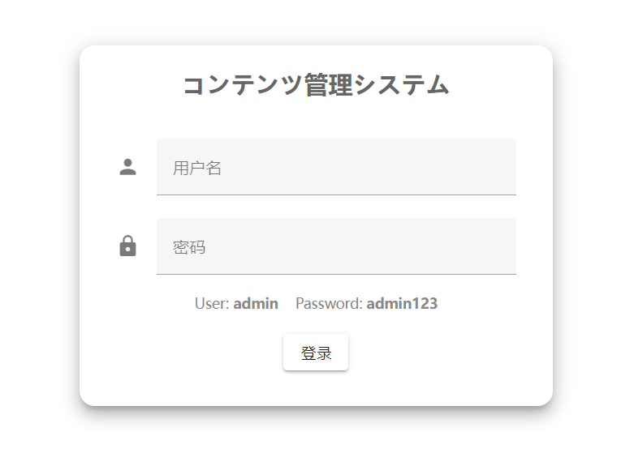
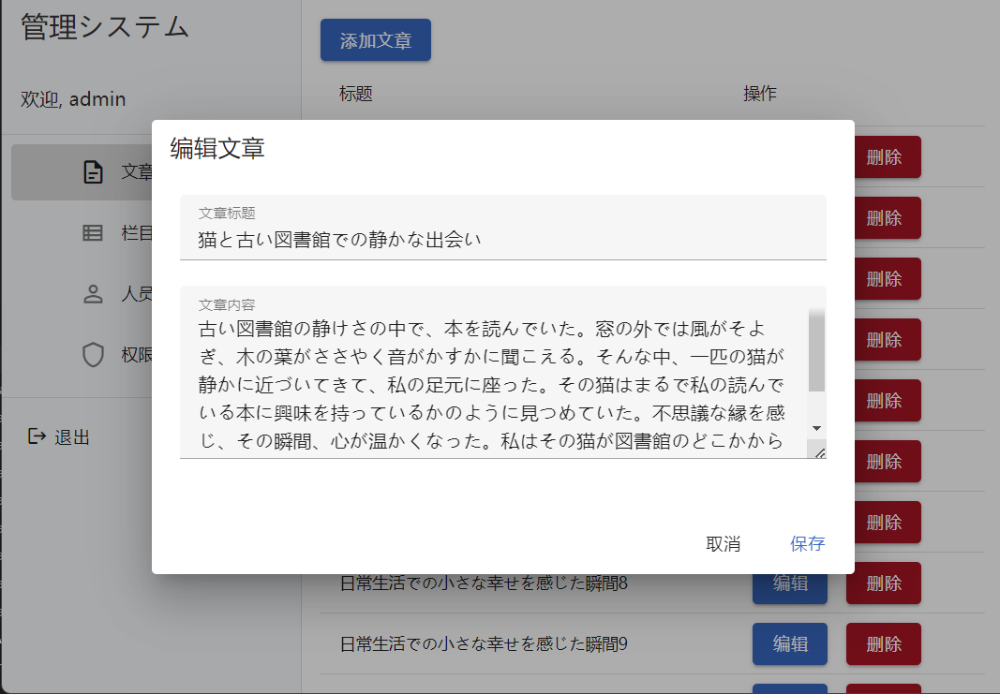
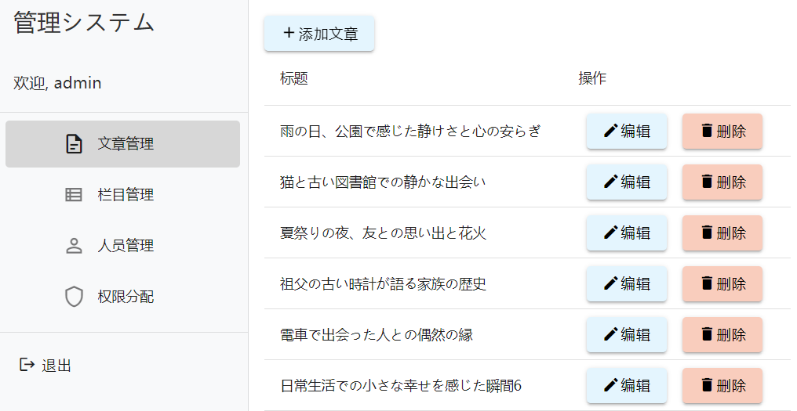
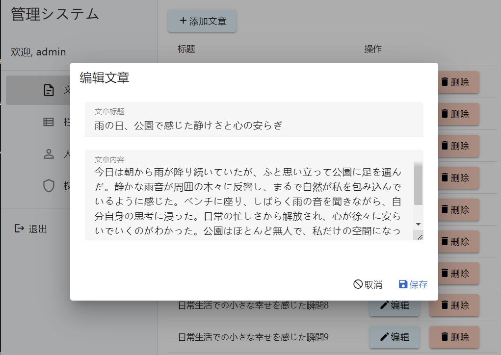
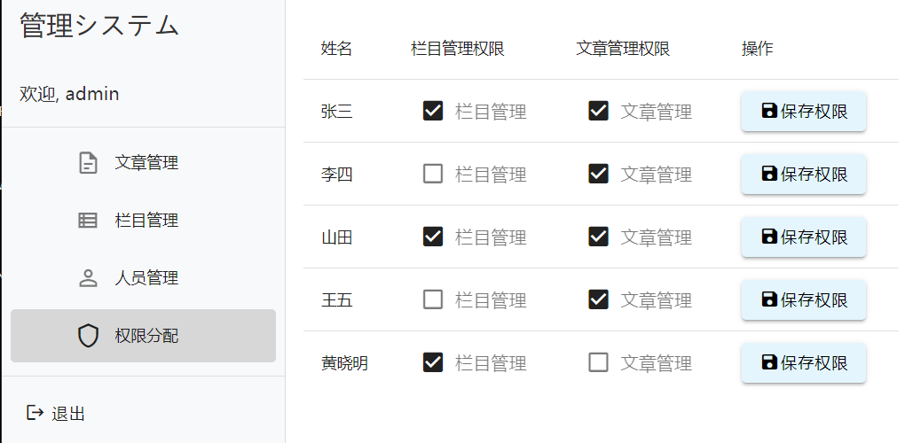
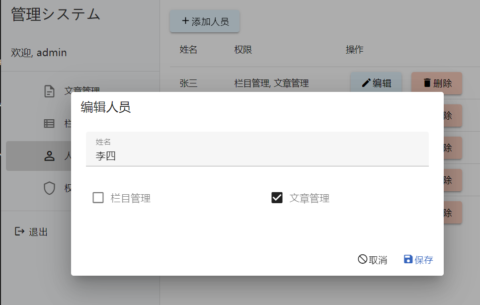

# 記事管理システム

**このプロジェクトは、Vue2からVue3へのリファクタリングを完了しました。**

これは `Vue3` と `Vuetify` をベースにした記事管理システムです。ユーザーは記事の一覧表示、記事の詳細表示、記事の追加・編集・削除、および記事を異なるカテゴリに割り当てることができます。また、管理者の管理と権限分配機能をサポートしています。
<br/><br/>
Demo: <a href="https://vue-vuetify-blog-system.vercel.app/">https://vue-vuetify-blog-system.vercel.app</a>

## 特徴

- **記事一覧表示**：記事データを取得し、ページに表示します。
- **記事詳細表示**：記事のタイトルをクリックすると、記事の詳細を確認できます。
- **読み込み状態インジケーター**：データ取得中に読み込みインジケーターを表示し、ユーザーに優しい体験を提供します。
- **記事の追加・編集・削除**：記事のCRUD操作が可能です。
- **カテゴリ管理**：カテゴリの追加・編集・削除、および記事を異なるカテゴリに割り当てる機能を提供します。
- **管理者管理**：管理者の追加・編集・削除を行います。
- **権限分配**：各管理者に権限を割り当て、システム内での役割を管理します。
- **レスポンシブUI**：モダンな `Vuetify` UI コンポーネントを使用して、レスポンシブなデザインを提供します。

## Screenshots

<br/>
<br/><br/>
<br/><br/>
<br/><br/>
<br/><br/>
<br/>

## 技術スタック

- **Vue 3**：フロントエンドフレームワーク、ユーザーインターフェースの構築に使用。
- **Vuetify**：Vue用のUIコンポーネントライブラリで、モダンなUIデザインを提供。
- **JavaScript (ES6)**：プロジェクトのロジック実装に使用。
- **HTML5 & CSS3**：基本的なページ構造とスタイル設計。

## 機能

1. **記事一覧**：
   - 記事データを取得し、全ての記事を一覧で表示。
   - 各記事のタイトルをクリックして詳細ページに移動。
   - 記事が異なるカテゴリに割り当てられ、ユーザーは記事を各カテゴリでフィルタリング可能。
   - データの読み込み中はインジケーターを表示。

2. **記事詳細**：
   - 記事のタイトル、コンテンツを表示。
   - 記事が存在しない場合はエラーメッセージを表示。
   - 記事の追加・編集・削除機能を提供し、CRUD操作が可能。

3. **カテゴリ管理**：
   - カテゴリの一覧表示、カテゴリの追加・編集・削除が可能。
   - 記事を異なるカテゴリに割り当てる機能をサポートし、各カテゴリに関連する記事を管理。

4. **管理者管理**：
   - 管理者の一覧表示、管理者の追加・編集・削除が可能。
   - 管理者は権限に応じてシステムの各セクションにアクセス。

5. **権限分配**：
   - システム管理者は各管理者に対して異なる役割や権限を設定可能。
   - 権限に基づき、システム内でのアクセス制限や操作が制御されます。

## 使用方法

### 開発環境のセットアップ

1. 依存関係のインストール：

   ```bash
   npm install
   ```

2. 開発サーバーの起動：

   ```bash
   npm run dev
   ```

3. ブラウザで以下のURLにアクセス：

   ```
   http://localhost:5173
   ```

### 記事とカテゴリ管理の使用

- **記事管理**：記事の追加、編集、削除ができ、記事を特定のカテゴリに割り当てることが可能です。管理者は記事を異なるカテゴリに移動することもできます。
- **カテゴリ管理**：カテゴリの追加、編集、削除が可能で、各カテゴリごとに記事を管理することができます。

### 管理者管理機能

このプロジェクトでは、管理者に対して異なる権限を割り当てる管理機能を提供しています。各管理者の権限に応じて記事管理やカテゴリ管理、さらに他の管理者の管理が可能です。管理者ごとに「システム管理者」「記事管理者」などの権限を設定することで、システムのセキュリティと運営が円滑になります。

## 今後の改善

- 管理者ごとの詳細なアクセス権限設定の拡充。
- ユーザー認証およびセキュリティ機能の追加。
- 複雑なフィルタリングおよび検索機能の強化。
